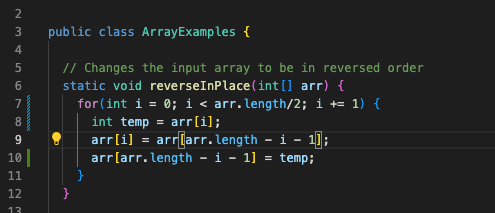

# Lab Report 2

## Part 1

Below is the code used for my StringServer


Below here are the two screenshots using /add-message


For the first screenshot
- The method that is called for this is Handler which implements URLHandler
- The relevant arguments to those methods are str and url and the value of str which contains the word that is meant to come after /add-message?s=
- One of the values 'str' changes from "" to whatever is inputed. For example, 'Hello' can be the word that is contained in str. Another value is the URI which changes from http://localhost:4657 to http://localhost:4657/add-message?=s<str>, to show how 'Hello' can be put in the URI you just need to add Hello at the end http://localhost:4657/add-message?s=Hello .

For the second screenshot
- The method that is called for this is Handler which implements URLHandler
- The relevant arguments to those methods are str and url and the value of str which contains the word that is meant to come after /add-message?s=
- One of the values 'str' changes from "" to whatever is inputed. For example, 'How are you' can be the word that is contained in str. Another value is the URI which changes from http://localhost:4657 to http://localhost:4657/add-message?=s<str>, to show how 'How are yo' can be put in the URI you just need to add 'How are you' at the end http://localhost:4657/add-message?s=How are you. Once added the server will automatically add %20 between the words.

## Part 2

1. Below is the failure inducing input as a JUnit test along with the associated code with it


```
public class ArrayTests {
	@Test 
	public void testReverseInPlace() {
    int[] input1 = { 3 };
    ArrayExamples.reverseInPlace(input1);
    assertArrayEquals(new int[]{ 3 }, input1);

    int[] input2 = { 1, 2, 3, 4, 5};
    ArrayExamples.reverseInPlace(input2);
    assertArrayEquals(new int[]{ 5, 4, 3 }, input2);
	}
```

2. Below is the input that doesn't induce a failure as a JUnit test along with the associated code


```
public class ArrayTests {
	@Test 
	public void testReverseInPlace() {
    int[] input1 = { 3 };
    ArrayExamples.reverseInPlace(input1);
    assertArrayEquals(new int[]{ 3 }, input1);

    int[] input2 = { 1, 2, 3, 4, 5};
    ArrayExamples.reverseInPlace(input2);
    assertArrayEquals(new int[]{ 5, 4, 3, 2, 1}, input2);
	}
  ```
  
  3. The symptom is shown below with the two inputs above
  
  
  
  
  
  4. The bug is shown below with its before and after screenshots
  
  Before
  
  
  
  After
  
  
  
  # Part 3
  
  One thing that I learned in week 3's lab was how to start a server, it was very interesting seeing how the process went and adding different functions to server while seeing it change in real time
